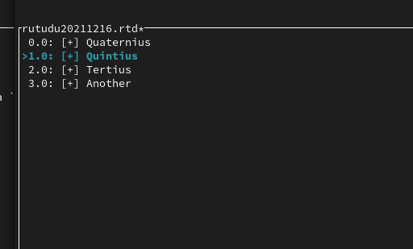
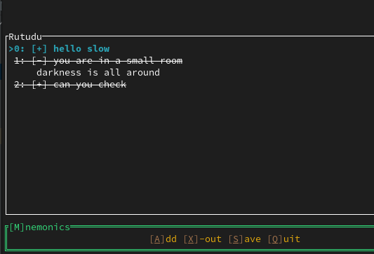
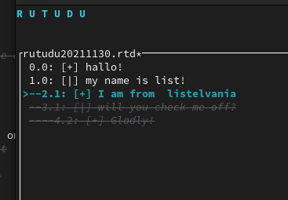
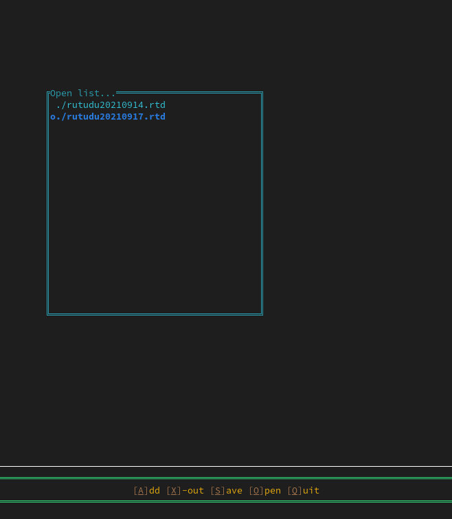
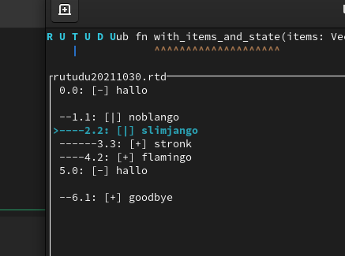

# rutudu
The simple, tui rust to do list. You can say it roo-too-doo or rah-tah-dah, or even rah-too-doo!

Work in progress but you can:

* Make simple list, with entry text
* Sub lists.

Wanted a TUI based todo list with hierarchies that doesn't just cat to the console,
but allows navigation,collapsing, etc. Couldn't find one so here we are.

You cannot edit, just yet.

You can cross-out and and uncross-out. Move items up and down - sibling-list and hierarchy.

Will auto open a new list with today's date, creating if necessary, if started with no arguments. Otherwise will
open/create passed in list name.

There is no undo. Sweaty palms but steady hands, my friend.

### You can add items!

* a to add an item
* Ctrl+a to add a sub item
* Alt+a to add new parent
* Shift + A to add new sibling
* __It is CTRL+N  to e(N)ter on the add item screen__
    * That's because enter is for newlines when creating items.
  * __As of recently, also Alt+Enter!! :D__
* Seriously, if somebody can teach me how to capture CTRL+enter, I'd be so grateful
  * Can't seem to modify enter on the terminal?
  * HOORAH! Managed to get Alt+Enter working
  * CTRL+Enter would be nice, though

### Manipulate items in the list
* x to (un)cross out item
* u move item *u*p (increase its rank among its siblings)
* d move item *d*own (decrease its rank among its siblings)
* \> move item in (become the child of preceding sibling)
* < move item out (become the sibling of its parent)
* delete or backspace to delete an item - but NOT it's children
* to be implemented: a ctrl+delete that also includes children

### Persistence
* s to save as sqlite file 
* o to load (up/down to select, press right/enter/ctrl+n to open)
* It's a sqlite file so now you have the data in a db, maybe that's cool for you.

I like having lots of short lists and they're stored for posterity in sqlite. Maybe in future, some kind of tool
to aggregate lists? W

Will integrate with my clockrust, my nascent timetracking project. In time. In time.

### ROADMAP

* Move items up/down
* edit? delete? AND GIVE IN TO THE EPHEMERAL??

